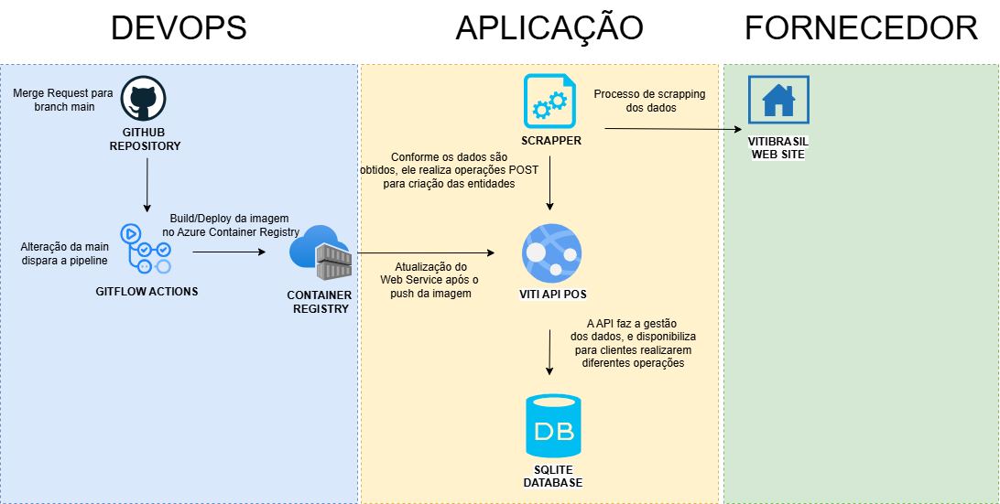
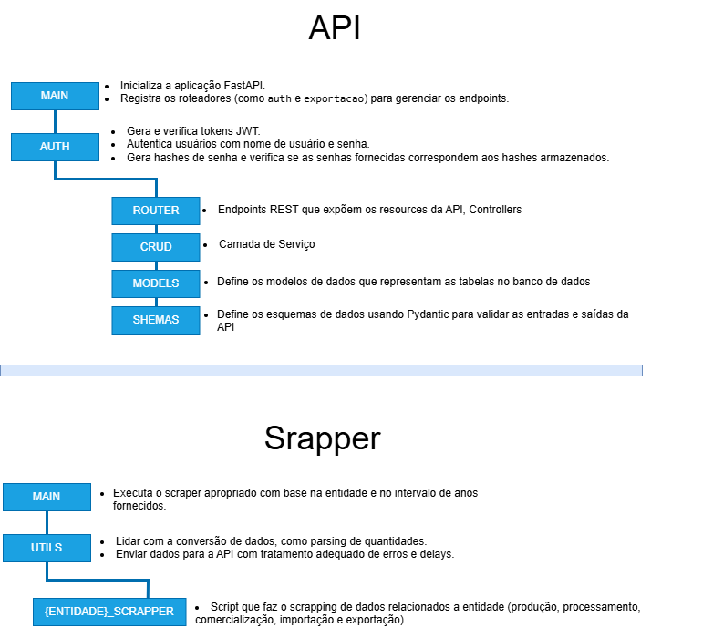

## Criando um ambiente virtual

```
python -m venv dev
```

## Ativando o ambiente

```
.\dev\Scripts\activate  # Windows
source dev/bin/activate  # Linux/Mac
```

## Instalando as dependências

```
pip install -r requirements.txt
```

## Executando a API

```
uvicorn app.main:app --reload
```

## Consultando a documentação da API

http://127.0.0.1:8000/docs

## Realizando uma carga de dados a partir do scrapper

- python main_scraper.py producao --ano_inicial 1970 --ano_final 2023
- python main_scraper.py processamento --ano_inicial 1970 --ano_final 2023
- python main_scraper.py comercializacao --ano_inicial 1970 --ano_final 2023
- python main_scraper.py importacao --ano_inicial 1970 --ano_final 2023
- python main_scraper.py exportacao --ano_inicial 1970 --ano_final 2023

## Acesso
Link Swagger: https://vitibrasilapi-hmh3gge4gkdgfthj.brazilsouth-01.azurewebsites.net/docs
Link API: https://vitibrasilapi-hmh3gge4gkdgfthj.brazilsouth-01.azurewebsites.net/

Usuário e senha para autenticação
Usuário: admin
Senha: abc123@abc

## Arquitetura Geral




